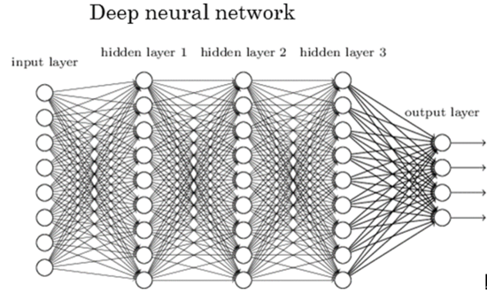

# Members

| 이름   | 학과        | 학번       | 이메일                 | 역할                                |
| ------ | ----------- | ---------- | ---------------------- | ----------------------------------- |
| 최준형 | ICT융합학부 | 2017013290 | junhyung9571@naver.com  | 코드 구현, 블로그 작성, 그래프 분석 |
| 김도원 | ICT융합학부 | 2018       |                         | 데이터셋 전처리 및 분석             |
| 황지훈 | ICT융합학부 | 2018045978 | wlgns7711@hanyang.ac.kr | 영상,자료조사,녹음,데이터셋 선정    |

# 1. Proposal

#### 1.1 Motivation
 

#### 매해 11월 쯤이면 미세먼지가 시작된다. 그떄마다 호흡기성 질환부터 피부염이나 아토피와 같은 질병의 원인이 되기도 하는 미세먼지에 많은 지자체에서 대응기사들이 쏟아진다. 올해도 어김없이 나오는 기사와 뿌옇게 변하는 하늘을 보며 우리가 일반적으로 확인하고 느끼는 기상정보처럼 이 미세먼지를 알 수는 없을지 궁금하였다. 화학 연료 사용의 증가로 인해 발생하는 미세먼지는 지자체 차원에서는 계절관리제 등의 규제와 대응이 더 중요하지만 개인들에게는 날짜와 기상,기온정보와 함께 미세먼지 정보를 마주하게 되므로 기상정보를 통해 미세먼지 농도를 예측할 수 있다면 개인들이 대응하기에는 더 유용할 수 있다는 생각을 하게 되었습니다.
 

#### 1.2 Final Goal
 

#### 과거의 기상정보와 미세먼지 데이터를 통해 다음날의 기상정보를 입력하면 미세먼지가 매우 나쁨,나쁨,보통,좋음으로 예측되도록 구현하는 걸 목표로 삼았습니다.
 

# 2. Datasets 

#### 2.1 Air Pollution in Seoul: EDA with maps(www.kaggle.com) - 이 데이터를 통해 2017-2019까지 1시간단위로 측정된 SO2,NO2,CO,O3,PM10,PM2.5 데이터를 얻었습니다. 그 중에서 PM10데이터만을 이용하였습니다.
 

#### 2.2 서울 기상데이터(https://data.kma.go.kr/cmmn/main.do) - 이 데이터를 통해 2017-2019까지 1시간 단위로 측정된 지면온도,습도,풍속,풍향,강수량,현지기압 데이터를 얻었습니다.
 

# 3. Methodology

### 3.1 데이터 전처리 - 데이터 합치는 코드랑 정규화하는 거 넣으면 될듯
 

### 3.2 sklearn을 이용한 train데이터와 test데이터 나누기
 

### 3.3 케라스를 이용한 DNN 구성
 

#### 1) DNN
 

#### DNN은 입력층(input layer)과 출력층(output layer) 사이에 여러 개의 은닉층(hidden layer)들로 이뤄진 인공신경망(Artificial Neural Network, ANN)이다.
 

#### DNN 모델을 사용하는 이유 - 머신러닝의 방법 중 우리는 지도학습 중 분류(classification)에 해당하므로 분류하는 여러 방법 중 가장 흥미로운 인공신경망을 이용해보고 싶어 선정하게 되었습니다. 
 

 
 

### 3. 4 학습률,활성함수,손실 함수,최적화 모델 선정
 

### 1) 학습률(Learning Rate)
 

#### Learning rate란 어느 정도의 크기로 기울기가 줄어드는 지점으로 이동하겠는가를 나타내는 지표이다. Learning rate의 값이 크다면 어떻게 될까? 처음 출발에는 기울기가 줄어드는 지점으로 이동을 하겠지만 어느 지점에서 최솟값에 도달하기 보다는 그 값을 넘어서 그래프의 반대편으로 지점이 이동할 수 있다. 이건 step의 간격이 너무 커서 발생하는 결과이다. 또한 이러한 차이가 계속 발생하게 되면 오히려 최솟값에 도달하기 보다는 그래프를 벗어나는 결과 값을 가지게 만들 수도 있다. 이러한 경우를 overshooting이라고 한다.  반대로 Learning rate의 값을 매우 작게 둔다면 어떻게 될까? 그러면 step의 간격이 매우 작게 된다는 것이다. 그러면 학습을 하는 과정에 속도가 매우 느리게 될 것이다. 만약 data를 학습하는 과정의 반복이 적을 경우 최솟값에 도달하기도 전에 학습이 끝나서 원하는 최솟값을 가질 수 없게 된다. 학습을 하고 있는 과정에도 cost 값이 거의 변하지 않는다면 Learning rate의 값이 매우 작다는 것을 의심해 봐야한다. 따라서 Learning rate을 매우 적절하게 적용시키는 것이 매우 중요하다. 실제로 대부분의 Learning rate의 값은 시작을 0.01로 시작해서 overshooting이 일어나면 Learning rate의 값을 줄이고 학습 속도가 매우 느리다면 Learning rate 값을 올리는 방향으로 학습을 진행하면 될 것이다.
 

 
 

### 2) 활성함수(Activation Function) 
 

#### 1. ReLU 함수
 

#### Relu 함수는 양수 신호는 그대로 인식하며, 음수 신호는 0으로 인식하여 차단하는 함수이다.렐루 함수를 은닉층의 활성화 함수로 사용하는 이유는 그 전에 가장 많이 사용되었던 시그모이드 함수는 0부터 1까지의 범위를 가지므로 레이어를 거칠 수록 기울기가 현저하게 작아지게 되는 기울기 손실이 발생하게 된다. 그러나 렐루 함수같은 경우 기울기 손실 문제가 발생하지 않는다. 또한 기존 활성화 함수에 비해 단순한 형태의 함수이기에  속도가 매우 빠르다. 
 

#### 렐루 함수의 한계점 - 입력값이 0인 경우는 모두 무시된다. 따라서 기울기가 0인경우에는 업데이트가 진행되지 않는다. 그래서 한번이라도 해당 뉴런이 음수를 반환하게 되면 그 이후로 0만 반환하며 아무것도 변하지 않는 현상이 발생한다.
 

 

 
 

#### 2. Softmax함수
 

#### 소프트 맥스 함수는 세 개 이상으로 분류하는 다중 클래스 분류에 사용되는 함수입니다.분류되는 n개의 클래스에 n개의 백터를 입력받아 각 클랙스에 속할 확률을 추정하는 함수로 확률의 총합이 항상 1이라는 성질에 따라 어떤 분류에 속할 확률이 가장 높을지 쉽게 인지할 수 있다는 장점이 있습니다. 따라서 다중 분류 문제에 사용됩니다.
 

#### 그러나 0-1까지의 값만을 출력하기 때문에 기울시 손실이라는 문제를 가지고 있어 은닉층에 사용하기에는 적합하지 않아 출력층에만 사용됩니다.
 

 
 

### 3) 손실 함수(loss function) 

#### 범주형 교차 엔트로피 오차-CCEE는 다중분류를 목표로 하기 때문에 소프트 맥스 함수를 출력층의 활성화 함수로 하여 [0.1,0.2,0.3,0.4]와 같은 형식의 one-hot-encoding된 형태로 나오게 된다. 이는 분류해야할 클래스가 3개 이상인 경우 사용되는 손실 함수입니다. 수식은 이렇게 됩니다.
 

 
 

### 4) 최적화 모델(optimizer)
 

#### 모델을 학습시키기 위해선 최적화라는 작업이 필요한데 이 때 gradient를 통해 weight를 바꾸어 주는 역할을 한다. 이 때 가장 기본적인 방법으로 SGD가 있는데 이는 모델에 입력된 data의 실제값과 예측값을 비교하여 구해진 loss를 미분하여 loss를 줄이는 것이 목표이다. 따라서 우리가 구하고 싶은 loss가 최소가 되는 지점을 gradient가 -가 되도록 값을 이동시킨다는 아이디어에서 나온 것이 SGD이다. 그러나 이런 SGD에도 단점이 있는데 2차함수가 아닌 3차 함수인 경우 최소점이 1개 이상이므로 이 때 사용하는 것이 Momentum이라는 개념이다 . 이전의 이동값과 관성을 주어 최소값에 도달하더라도 앞으로 더 나아가 지역 죄소값을 탈출하게 해준다. 그리고 이 때 관성과 스텝사이즈까지 조절이 가능한 것이 adam 이다. 
 

 
 

### 5)결과값 출력 및 정확도 분석

# 4. Evaluation & Analysis

# 5. Related Work

# 6. Conclusion: Discussion 

---
